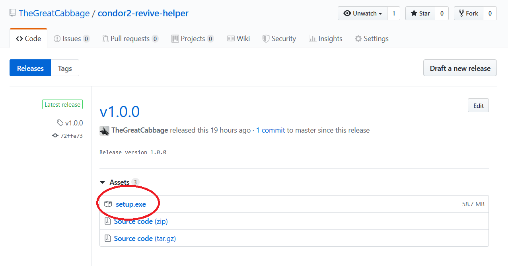

# Condor2 Revive Helper

## Introduction
Condor2 Revive Helper is a program to handle opening multiplayer sessions of Condor2 via Revive.

Condor2 is an excellent soaring simulator which features VR support via the Oculus SDK, forcing many great VR headsets to use Revive. Multiplayer sessions are launched by clicking a link which opens Condor2 directly, completely skipping the necessary step of injecting the executable into Revive.

The workaround is not painless: opening Condor2 via the link in non-VR mode, copying the IP address, closing Condor2, opening Condor2 via Revive and pasting in the IP address. This program, along with the [Condor2 Revive Extension](https://github.com/TheGreatCabbage/condor2-revive-extension) for Firefox and Chrome, aims to restore the simple process of clicking a link to open a multiplayer session with VR.

## Installing and Using the Program
You can download the installer from the [releases](https://github.com/TheGreatCabbage/condor2-revive-helper/releases) page. 

When you run the installer, Windows will usually block it with a SmartScreen dialog (this is because the installer is not signed with a digital certificate). To continue, just press "More info" and then "Run anyway".

After completing the installation, you should launch the program to configure it. 

The program will detect the location of Condor2 and Revive automatically if they are in `Program Files` or `Program Files (x86)` on any drive. If the text fields are filled, there should be no need to edit them manually.

If Condor2 and Revive are not detected, you can enter them manually:
- For Condor2, find the directory and enter its path in the text field. This will be of the form `C:\Program Files\Condor2`.
- For Revive, find the `Revive` directory *inside* the base `Revive` directory and enter its path in the text field. This will be of the form `C:\Program Files\Revive\Revive`.
- Don't forget to press "Save and exit".

You can use the "Create shortcut" button to create a desktop shortcut which will launch Condor2 via Revive in normal single-player mode. To launch multiplayer sessions from the browser, you will need to install the browser extension. The browser extension is currently only available for Firefox, but Chrome support is planned.

After installing the browser extension, you should be able to launch multiplayer sessions with ease. The Condor2 Revive Helper will launch Condor2 without making itself visible, so the user experience will be identical to Oculus and non-VR users.
